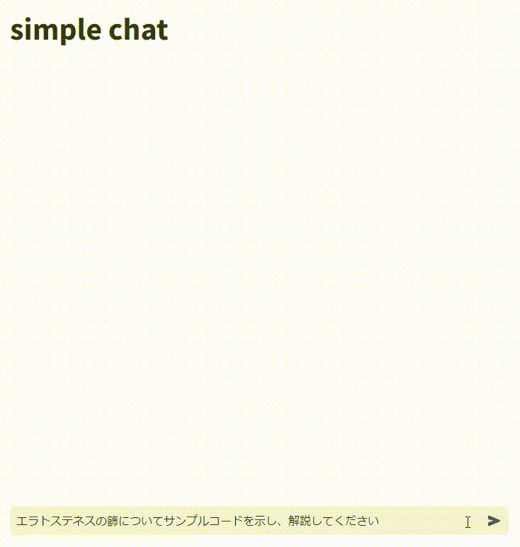

## このアプリについて

https://huggingface.co/elyza/ELYZA-japanese-CodeLlama-7b-instruct をローカルで動作させるデモアプリ

## 検証環境

- OS: Windows11

- メモリ: 64 GB

- GPU: NVIDIA GeForce RTX 4090

- CPU: Intel Corei9-14900KF

## 使用方法

1. `docker compose up`でdockerコンテナを起動する

2. `http://localhost:8080/`にアクセスする

3. 以下のデモ画面の`What is up?`の部分に質問したいことを記載

## 使用技術

- 画面: [stremlit](https://streamlit.io/)

- モデルライブラリ: [transformers](https://github.com/huggingface/transformers/tree/main)

## 想定していないこと

- 多人数アクセス: アクセス制御などは実施していないので、アクセス数が増えるとメモリエラーになる可能性あり

- 会話履歴に応じた解答の生成
